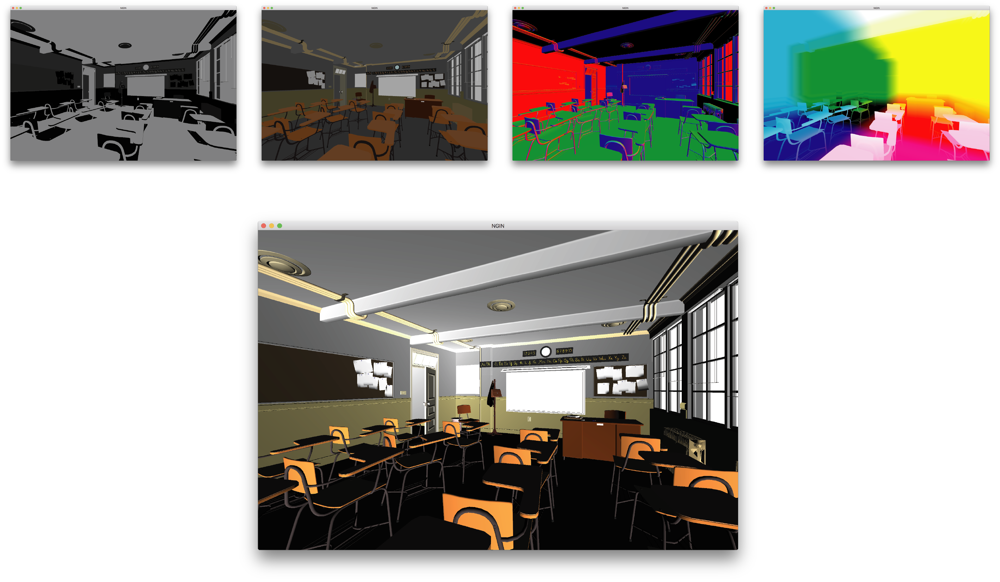
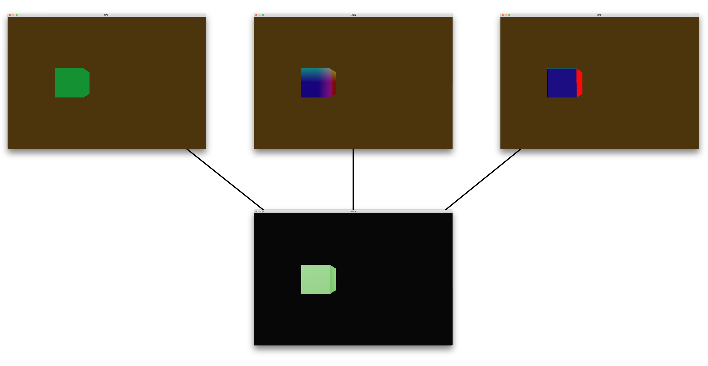
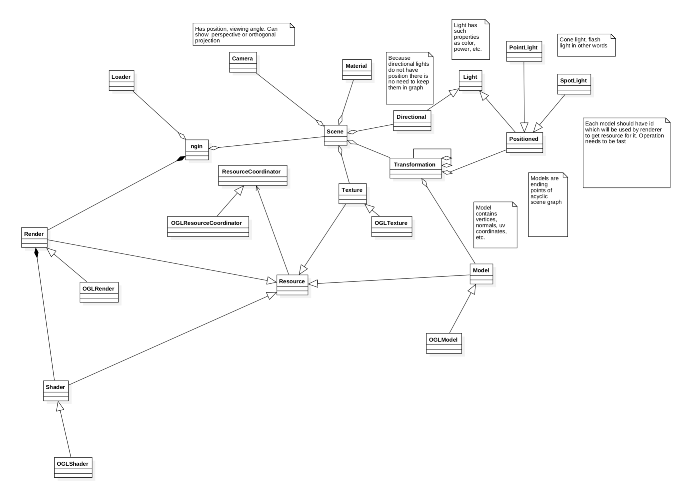

# ngin

## 13.03.2018 Assimp materials and models loading

I have integrated project with assimp library. It enables engine to load models, their materials and textures. You can see that there is one additional image comparing to the post from the previous day. It represents specular component of material

## 12.03.2018 Basics of deferred & forward renderer have been implemented

In the picture below you can see process of rendering. In the first one normal vectors, colors and positions of objects in world coordinates are rendered into three separate textures. Then, in the second pass these textures are used to calculate influence of lights placed on the scene and final color of each pixel

## 02.03.2018 Development process start

I have created initial version of class diagram for the project. It has been constantly updated since the beginning of development.
I want to avoid major changes and in my opinion UML diagrams are the best way of doing it properly

