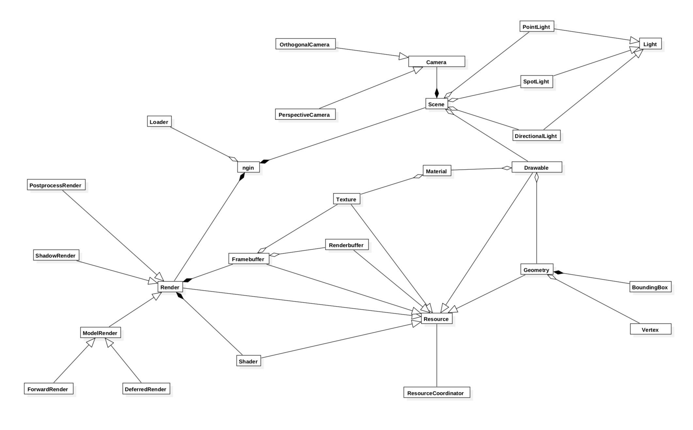

# ngin

## 02.02.2018 Development process start

I have created initial version of class diagram for the project. It has been constantly updated since the beginning of development.
I want to avoid major changes and in my opinion UML diagrams are the best solution how do it properly

